# diyC学習ガイド By Claude

Linuxコンテナランタイムをゼロから作って学ぶプロジェクトの体系的な学習資料です。

## 第1章：diyC プロジェクトの理解

### 1.1 diyC とは何か

diyC（DIY Container）は、Linuxコンテナランタイムの仕組みを学ぶための教育用プロジェクトです。DockerやPodmanなどのコンテナランタイムが、実際にはどのような技術で構築されているのかを理解するために、その基本的な機能をわずか500行のCコードで実装しています。

このプロジェクトの最大の特徴は、コンテナが「魔法」ではないということを明確に示している点です。コンテナは、Linuxが提供する基本的な機能を組み合わせて実現されており、その仕組みを理解することで、現代のクラウドネイティブ技術に対する深い洞察を得ることができます。

### 1.2 プロジェクトの全体像

diyC プロジェクトは、以下のような構成になっています：

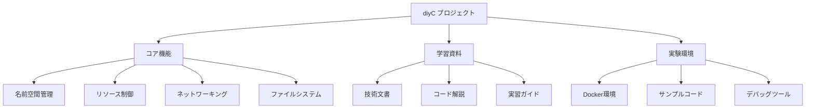

### 1.3 学習の価値

現代のソフトウェア開発において、コンテナ技術は必要不可欠な要素となっています。しかし、多くの開発者がDockerを使いこなしていても、その内部動作については十分に理解していないのが現状です。

コンテナの仕組みを理解することで、以下のような恩恵を受けることができます。まず、コンテナで発生する問題を根本から理解し、効率的にトラブルシューティングできるようになります。また、セキュリティ上の懸念点を把握し、適切な対策を講じることができます。さらに、パフォーマンスの最適化や、特定の要件に応じたコンテナ環境の構築も可能になります。

## 第2章：コンテナ技術の基礎

### 2.1 コンテナとは何か

Linuxコンテナは、基本的にプロセスの実行環境を制御する技術です。通常のプロセスがシステム全体を見ることができるのに対し、コンテナ内のプロセスは、制限された「世界」だけを見ることができます。

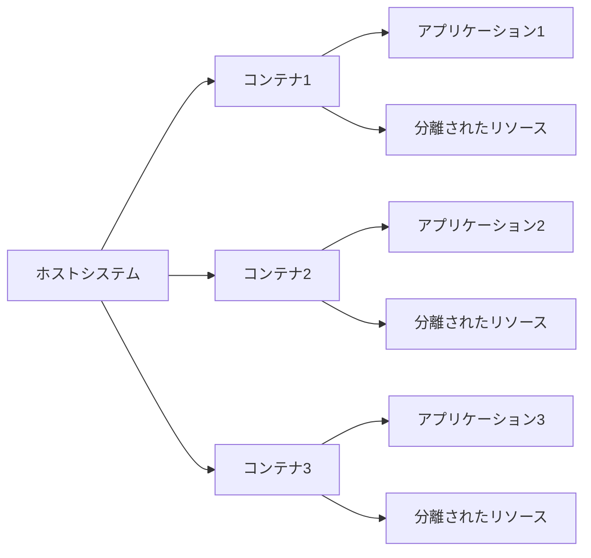

### 2.2 仮想化とコンテナの違い

従来の仮想化技術では、仮想マシンがそれぞれ独立したOSを持つため、リソースの消費が大きくなります。一方、コンテナはホストOSのカーネルを共有しながら、プロセスレベルでの分離を実現します。

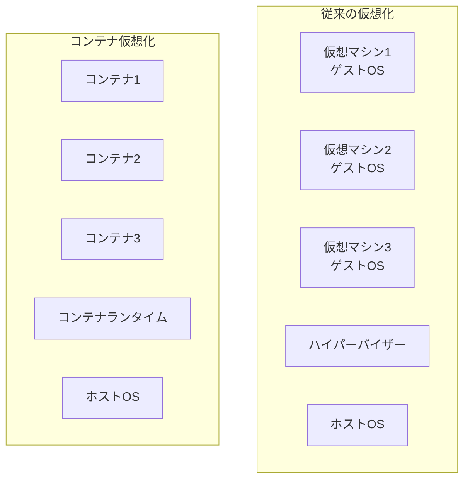

### 2.3 コンテナの構成要素

コンテナは複数のLinux機能を組み合わせて実現されています。これらの機能は、それぞれ異なる側面からプロセスの実行環境を制御します。

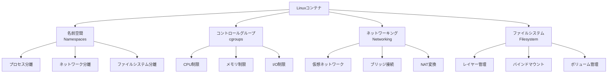

## 第3章：Linux名前空間の理解

### 3.1 名前空間の概念

名前空間は、Linuxコンテナの根幹となる技術です。この仕組みにより、同じシステム上で動作する複数のプロセスが、まるで独立したシステムで動作しているかのように見せることができます。

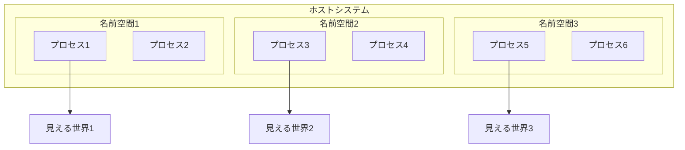

### 3.2 主要な名前空間の種類

Linux は複数の種類の名前空間を提供しており、それぞれが異なるリソースを分離します。

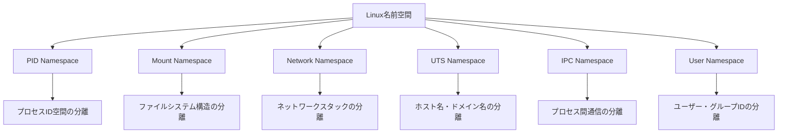

### 3.3 PID名前空間の仕組み

PID名前空間では、プロセスIDの空間を分離します。これにより、コンテナ内のプロセスは、自分がPID 1から始まる新しいシステムで動作していると認識します。実際には、ホストシステムでは異なるPIDを持っているにもかかわらず、コンテナ内では独立したプロセス空間を持つことになります。

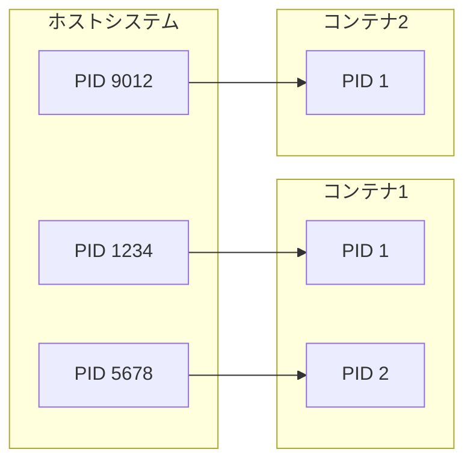

### 3.4 マウント名前空間の仕組み

マウント名前空間は、ファイルシステムの構造を分離します。これにより、コンテナは独自のルートファイルシステムを持ち、ホストシステムのファイルシステムとは独立した構造を構築できます。この分離により、コンテナ内のアプリケーションは、必要最小限のファイルシステムだけを見ることができ、セキュリティと移植性が向上します。

```mermaid
graph TB
    subgraph "ホストファイルシステム"
        HR[/]
        HB[/bin]
        HE[/etc]
        HV[/var]
    end
    
    subgraph "コンテナ1ファイルシステム"
        C1R[/]
        C1B[/bin]
        C1E[/etc]
        C1A[/app]
    end
    
    subgraph "コンテナ2ファイルシステム"
        C2R[/]
        C2B[/bin]
        C2E[/etc]
        C2W[/web]
    end
```

### 3.5 ネットワーク名前空間の仕組み

ネットワーク名前空間では、ネットワークスタック全体を分離します。コンテナは独自のネットワークインターフェース、ルーティングテーブル、ファイアウォール設定を持つことができます。これにより、複数のコンテナが同じポート番号を使用したり、異なるネットワーク設定を持つことが可能になります。

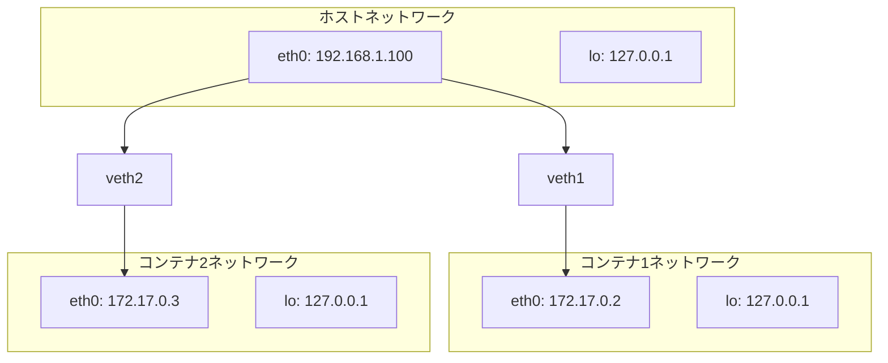

### 3.6 UTS名前空間の仕組み

UTS名前空間は、ホスト名とドメイン名を分離します。これにより、各コンテナは独自の識別子を持つことができ、アプリケーションが動作するホスト環境を適切に認識できます。

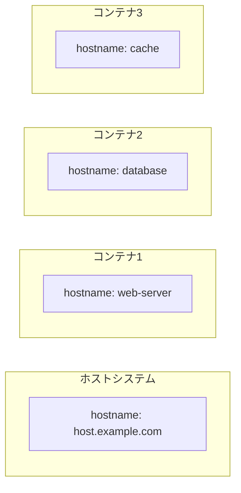

## 第4章：リソース制御システム

### 4.1 cgroupsの基本概念

cgroupsは、コンテナのリソース使用量を制限し、監視するための仕組みです。これにより、コンテナが使用できるCPU、メモリ、ディスクI/Oなどのリソースを制御できます。

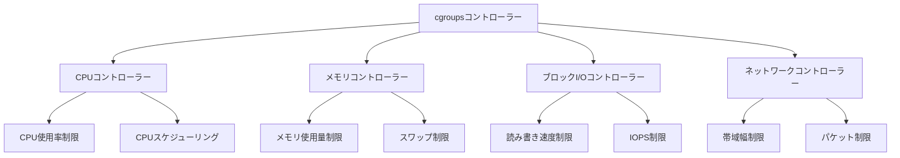

### 4.2 cgroupsの階層構造

cgroupsは階層的な構造を持ち、プロセスグループを効率的に管理します。親グループから子グループへリソースが配分され、細かい制御が可能になります。

```mermaid
graph TB
    subgraph "cgroups階層"
        ROOT[/sys/fs/cgroup]
        ROOT --> SYSTEM[system.slice]
        ROOT --> USER[user.slice]
        ROOT --> DOCKER[docker]
        
        DOCKER --> CONTAINER1[container1]
        DOCKER --> CONTAINER2[container2]
        DOCKER --> CONTAINER3[container3]
        
        CONTAINER1 --> PROC1[process1]
        CONTAINER1 --> PROC2[process2]
        CONTAINER2 --> PROC3[process3]
        CONTAINER3 --> PROC4[process4]
    end
```

### 4.3 CPU制限の実装

CPU制限では、コンテナが使用できるCPU時間を制限します。これにより、一つのコンテナが他のコンテナの性能に悪影響を与えることを防ぎます。

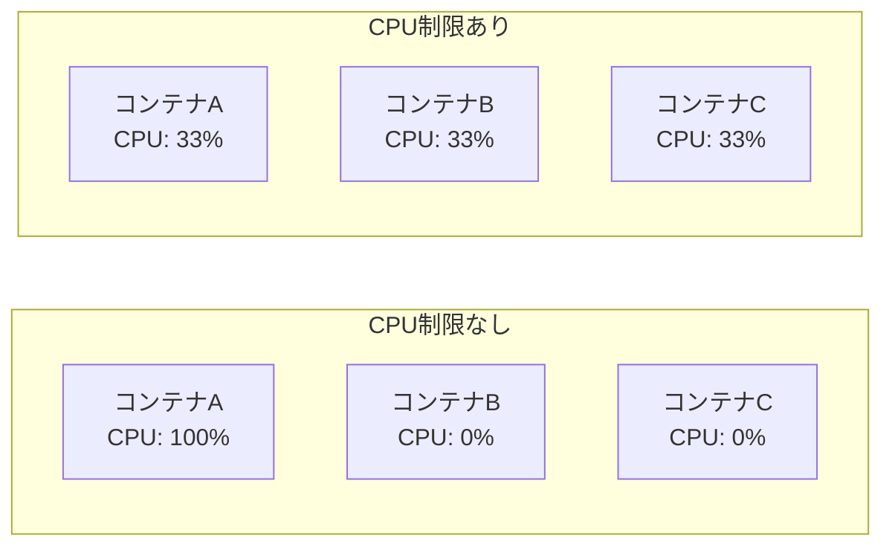

### 4.4 メモリ制限の実装

メモリ制限では、コンテナが使用できるメモリ量を制御し、メモリ不足によるシステム全体の不安定化を防ぎます。

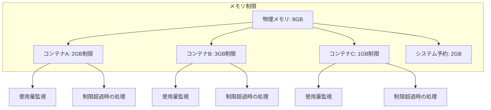

### 4.5 ディスクI/O制限の実装

ディスクI/O制限では、読み書き速度を制御することで、ディスクリソースの公平な分配を実現します。これらの制限により、マルチテナント環境でも安定したサービスの提供が可能になります。

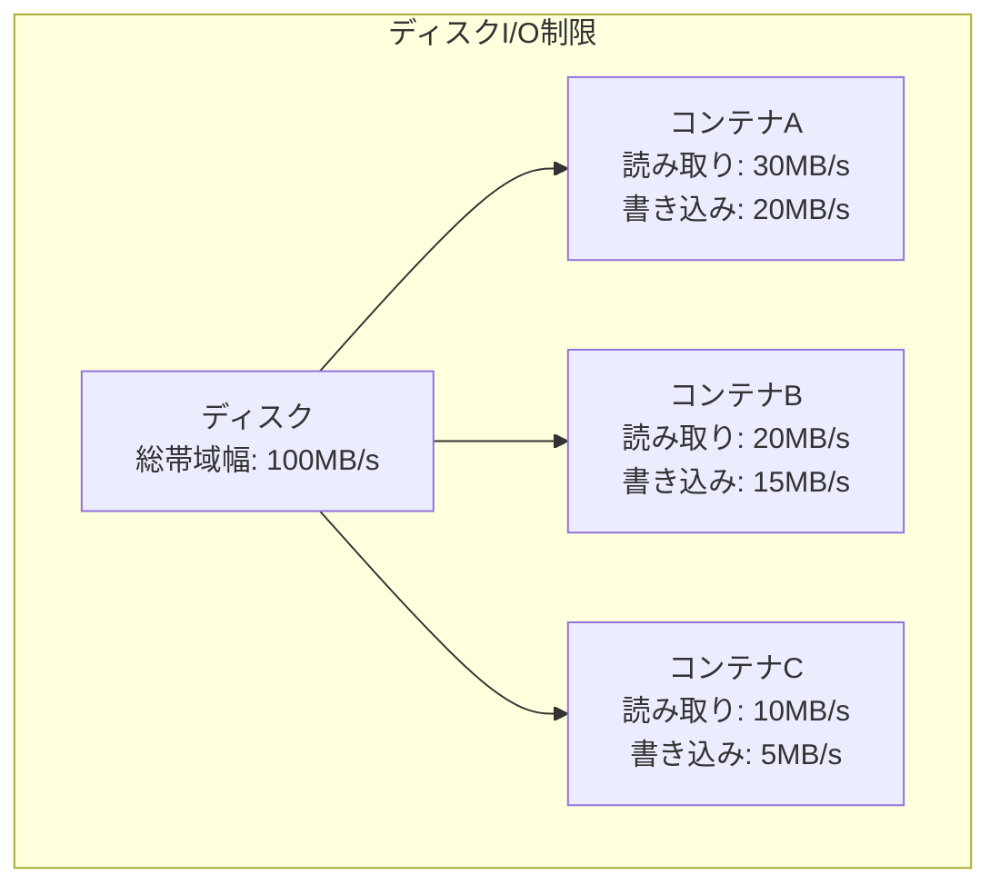

## 第5章：コンテナネットワーキング

### 5.1 ネットワーク分離の原理

コンテナネットワーキングは、複数のコンテナ間、およびコンテナとホストシステム間の通信を可能にする技術です。ネットワーク名前空間によって分離されたネットワーク環境を、適切に接続することで実現されます。

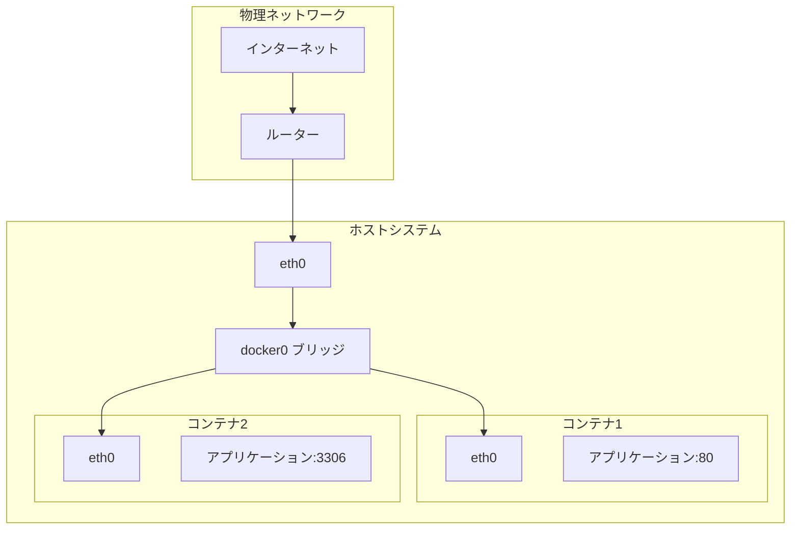

### 5.2 仮想イーサネット（veth）の仕組み

仮想イーサネット（veth）は、二つのネットワークインターフェースをペアで作成し、異なる名前空間間でのネットワーク通信を可能にします。一方のインターフェースをホスト側に、もう一方をコンテナ側に配置することで、分離されたネットワーク空間同士をつなぐことができます。

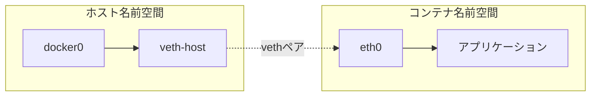

### 5.3 ブリッジネットワークの実装

ブリッジネットワークは、複数のネットワークインターフェースを接続し、コンテナ間の通信を可能にします。これにより、同じホスト上の複数のコンテナが、仮想的なネットワークセグメントを共有できます。

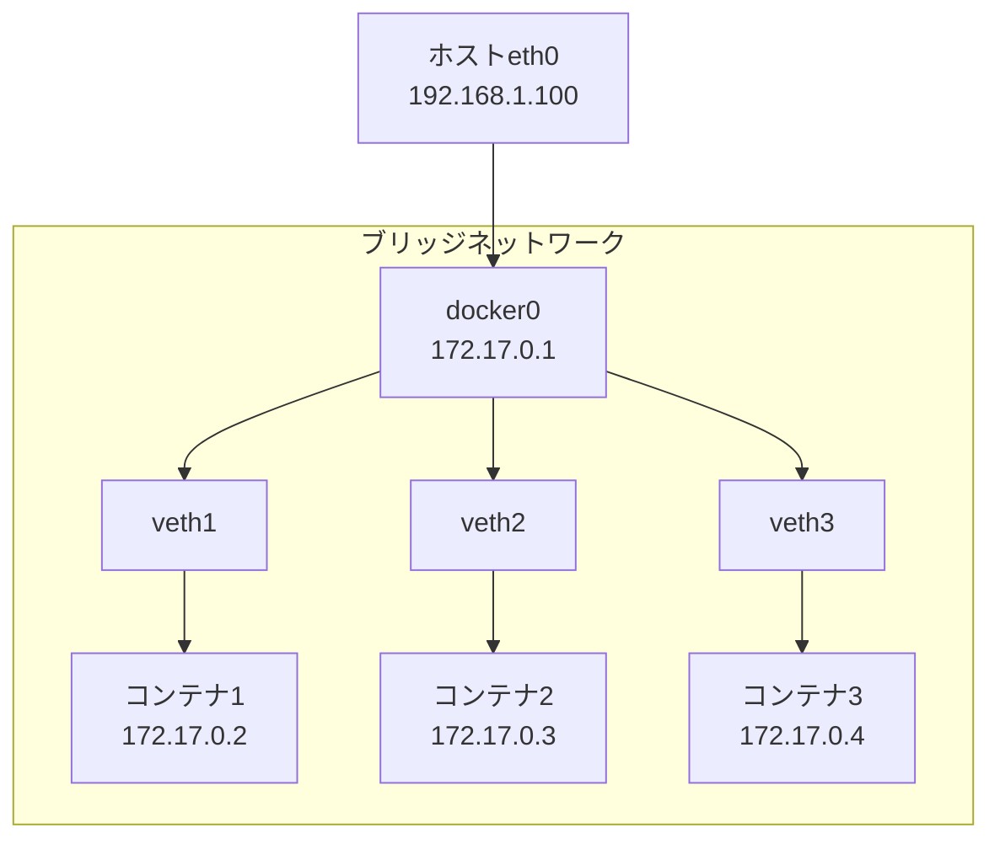

### 5.4 NAT（Network Address Translation）の役割

NAT機能により、コンテナ内の私有IPアドレスを、外部ネットワークから見えるIPアドレスに変換します。これにより、コンテナ内のアプリケーションが外部ネットワークにアクセスできるようになります。

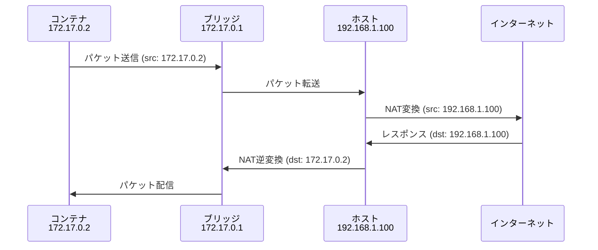

## 第6章：ファイルシステムの仮想化

### 6.1 ファイルシステム分離の概念

コンテナのファイルシステムは、効率性と分離性を両立するように設計されています。各コンテナは独立したファイルシステムツリーを持ちながら、共通のベースイメージを効率的に共有できます。

```mermaid
graph TB
    subgraph "ファイルシステム分離"
        HOST_FS[ホストファイルシステム]
        
        subgraph "コンテナ1"
            C1_ROOT[/]
            C1_BIN[/bin]
            C1_APP[/app]
        end
        
        subgraph "コンテナ2"
            C2_ROOT[/]
            C2_BIN[/bin]
            C2_WEB[/web]
        end
        
        subgraph "コンテナ3"
            C3_ROOT[/]
            C3_BIN[/bin]
            C3_DB[/db]
        end
    end
    
    HOST_FS -.->|分離された視点| C1_ROOT
    HOST_FS -.->|分離された視点| C2_ROOT
    HOST_FS -.->|分離された視点| C3_ROOT
```

### 6.2 OverlayFSのレイヤー構造

OverlayFSは、複数のファイルシステムレイヤーを重ね合わせて、統合されたファイルシステムを提供します。基礎となるイメージレイヤーは読み取り専用であり、コンテナ固有の変更は上位のレイヤーに記録されます。

```mermaid
graph TB
    subgraph "OverlayFSレイヤー構造"
        MERGED[merged<br/>統合ビュー]
        
        UPPER[upperdir<br/>書き込み可能レイヤー]
        LOWER1[lowerdir1<br/>アプリケーションレイヤー]
        LOWER2[lowerdir2<br/>ライブラリレイヤー]
        LOWER3[lowerdir3<br/>ベースOSレイヤー]
        
        MERGED --> UPPER
        MERGED --> LOWER1
        MERGED --> LOWER2
        MERGED --> LOWER3
    end
    
    WORK[workdir<br/>作業ディレクトリ]
    UPPER -.->|作業用| WORK
```

### 6.3 効率的なストレージ管理

複数のコンテナが同じベースイメージを共有しながら、それぞれ独立した変更を行うことができます。これにより、ストレージの使用効率が大幅に向上します。

```mermaid
graph TB
    subgraph "効率的なストレージ共有"
        BASE[ベースイメージ<br/>ubuntu:20.04]
        
        BASE --> CONTAINER1[コンテナ1<br/>Webサーバー]
        BASE --> CONTAINER2[コンテナ2<br/>データベース]
        BASE --> CONTAINER3[コンテナ3<br/>キャッシュ]
        
        CONTAINER1 --> LAYER1[変更レイヤー1<br/>nginx設定]
        CONTAINER2 --> LAYER2[変更レイヤー2<br/>mysql設定]
        CONTAINER3 --> LAYER3[変更レイヤー3<br/>redis設定]
    end
```

### 6.4 バインドマウントとボリューム

バインドマウントは、ホストシステムのディレクトリをコンテナ内にマウントする機能です。これにより、永続的なデータストレージや、設定ファイルの共有などが可能になります。

```mermaid
graph TB
    subgraph "ホストシステム"
        HOST_DATA[/host/data]
        HOST_CONFIG[/host/config]
        HOST_LOGS[/host/logs]
    end
    
    subgraph "コンテナ"
        CONTAINER_DATA[/app/data]
        CONTAINER_CONFIG[/app/config]
        CONTAINER_LOGS[/app/logs]
    end
    
    HOST_DATA -.->|バインドマウント| CONTAINER_DATA
    HOST_CONFIG -.->|バインドマウント| CONTAINER_CONFIG
    HOST_LOGS -.->|バインドマウント| CONTAINER_LOGS
```

## 第7章：学習の進め方

### 7.1 段階的学習アプローチ

このプロジェクトの学習は、段階的に進めることが重要です。無理に全てを理解しようとせず、一つずつ確実に理解していくことで、最終的により深い理解を得ることができます。

```mermaid
graph TB
    STAGE1[第1段階<br/>基礎知識の習得]
    STAGE2[第2段階<br/>技術要素の個別学習]
    STAGE3[第3段階<br/>ソースコード解読]
    STAGE4[第4段階<br/>実装とカスタマイズ]
    
    STAGE1 --> STAGE2
    STAGE2 --> STAGE3
    STAGE3 --> STAGE4
    
    STAGE1 --> S1_1[Linuxの基本概念]
    STAGE1 --> S1_2[コンテナの基本操作]
    
    STAGE2 --> S2_1[名前空間の実験]
    STAGE2 --> S2_2[cgroupsの実験]
    STAGE2 --> S2_3[ネットワークの実験]
    
    STAGE3 --> S3_1[nsexec.cの解読]
    STAGE3 --> S3_2[diyc.cの解読]
    
    STAGE4 --> S4_1[最小コンテナの実装]
    STAGE4 --> S4_2[機能の段階的追加]
```

### 7.2 理論と実践のバランス

効果的な学習のためには、理論と実践のバランスが重要です。ドキュメントを読んで理論を理解したら、必ず実際にコードを動かして動作を確認してください。一度にすべてを理解しようとせず、一つの概念を完全に理解してから次に進むことが重要です。

また、学習過程で疑問が生じた場合は、sample/docs/の詳細なドキュメントを参照したり、man pagesを確認したりすることで、より深い理解を得ることができます。

### 7.3 期待される成果

このプロジェクトを完了することで、Docker/Podmanなどのコンテナランタイムの仕組みを深く理解できるようになります。また、Linuxシステムプログラミングのスキルが身につき、コンテナのトラブルシューティング能力が向上します。最終的には、自分でコンテナランタイムを作れるようになり、現代のクラウドネイティブ技術に対する確固たる理解を得ることができます。

この知識は、単にコンテナ技術の理解にとどまらず、システム全体の設計や運用に対する深い洞察をもたらし、より効率的で安全なシステム構築に役立つでしょう。

```mermaid
graph TB
    START[diyC学習開始]
    
    KNOWLEDGE[深い技術理解]
    SKILL[実践的スキル]
    CAREER[キャリア発展]
    
    START --> KNOWLEDGE
    START --> SKILL
    
    KNOWLEDGE --> K1[コンテナ内部構造の理解]
    KNOWLEDGE --> K2[Linuxシステムの深い理解]
    KNOWLEDGE --> K3[セキュリティ観点の獲得]
    
    SKILL --> S1[トラブルシューティング能力]
    SKILL --> S2[システム設計スキル]
    SKILL --> S3[パフォーマンス最適化]
    
    K1 --> CAREER
    K2 --> CAREER
    K3 --> CAREER
    S1 --> CAREER
    S2 --> CAREER
    S3 --> CAREER
    
    CAREER --> C1[システムエンジニア]
    CAREER --> C2[DevOpsエンジニア]
    CAREER --> C3[プラットフォームエンジニア]
``` 